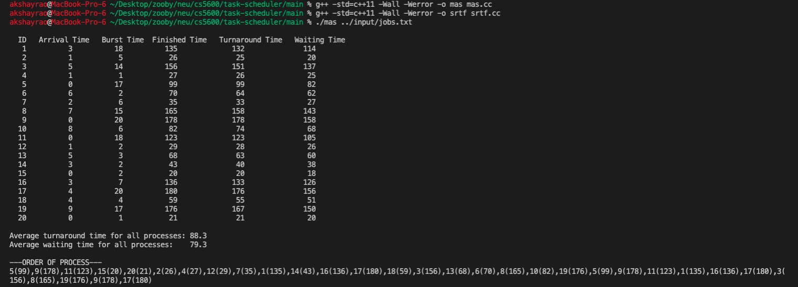
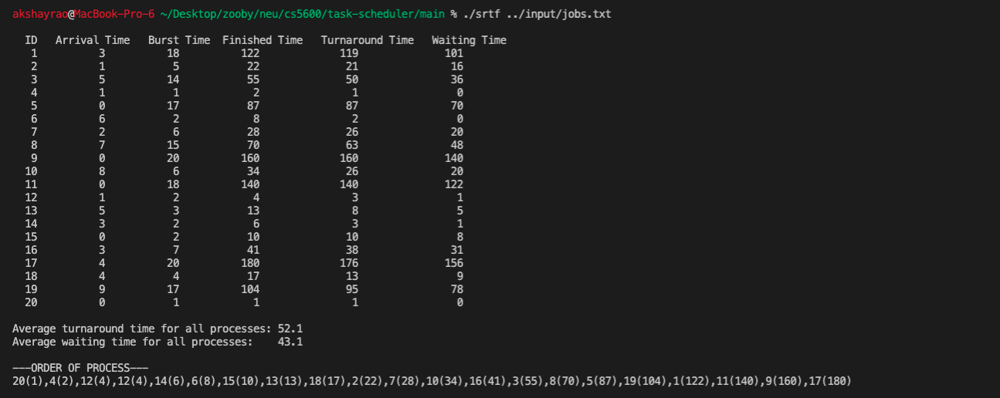

# Process Scheduler Simulation

This repository contains the necessary files and programs to simulate process scheduling algorithms using a list of processes provided in a CSV-formatted text file. The simulation covers two scheduling algorithms: Multiqueue Adaptive Scheduling (MAS) and Shortest-Remaining-Time-First (SRTF).

## Contents

- `mas.cc`: C++ source file for MAS scheduling simulation.
- `srtf.cc`: C++ source file for SRTF scheduling simulation.
- `jobs.txt`: Sample input file containing process data in CSV format.
- Output Screenshots: Visual proof of the program's execution results.

## Scheduling Algorithms

### Multiqueue Adaptive Scheduling (MAS)

Implemented in `mas.cc`, this algorithm dynamically adjusts queues based on process behavior, optimizing for both I/O-bound and CPU-bound processes.

### Shortest-Remaining-Time-First (SRTF)

Implemented in `srtf.cc`, this preemptive scheduling algorithm selects the process with the shortest remaining execution time to run next.

## Features

Both `mas.cc` (MAS) and `srtf.cc` (SRTF) programs output the following details:

1. Termination and waiting times for all processes.
2. Average termination time and average waiting time.
3. Execution order of processes on the CPU.

## Compilation Instructions

To compile each program and create their respective executables, use the following commands:

- For Multilevel Queue scheduling task simulation (`mas.cc`):

  ```sh
  g++ -std=c++11 -Wall -Werror -o ./main/mas ./main/mas.cc
  ```

- For Shortest Reamining Time First task simulation (`mas.cc`):

```sh
  g++ -std=c++11 -Wall -Werror -o ./main/srtf ./main/srtf.cc
```

## Running the Simulations

To run the simulations, specify the path to a single text file as an argument. This file must be in CSV format with three columns: process ID, burst time, and arrival time, in that order. The file must contain at least one process entry.
Example Commands

    For MAS scheduling simulation:

```sh
./main/mas ./input/jobs.txt
```

For SRTF scheduling simulation:

```sh
./main/srtf ./input/jobs.txt
```

If an invalid file is provided, the program will print an error message, usage details, and an example command.

## Output




